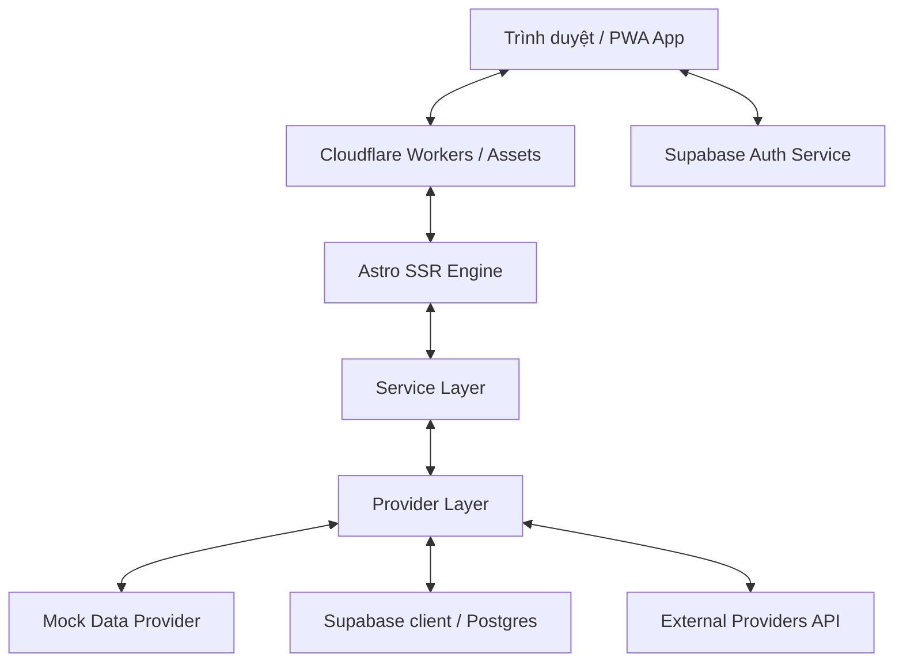
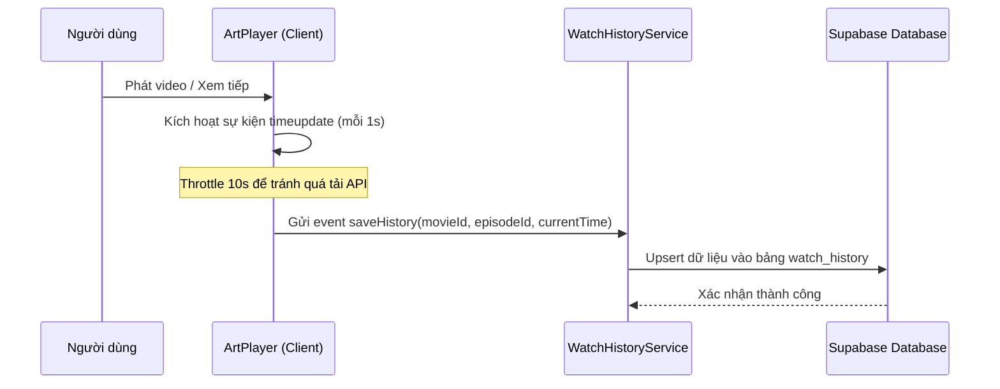
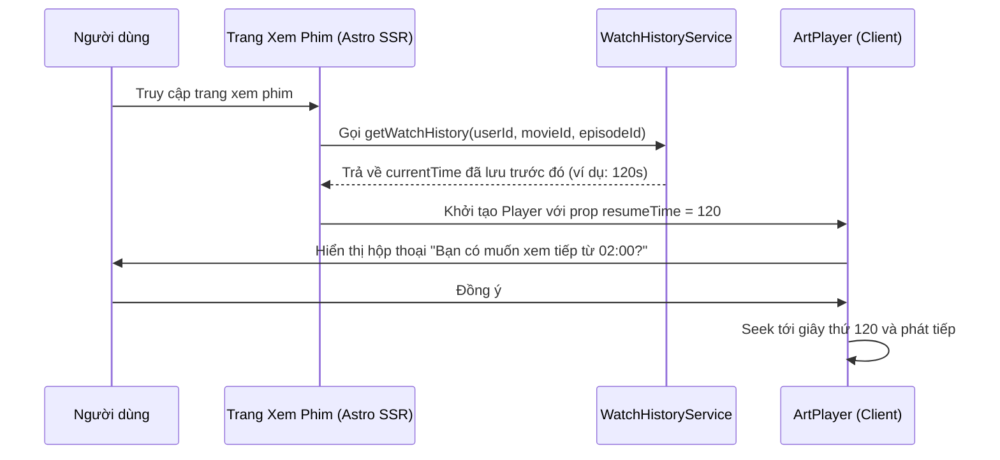

# ARCHITECTURE - Hệ Thống WebFilm

Tài liệu này mô tả chi tiết kiến trúc hệ thống, các luồng xử lý chính và hạ tầng của dự án **WebFilm**.

---

## 🗺️ Sơ đồ tổng quan kiến trúc



---

## 1. Frontend Architecture (Kiến trúc Frontend)

Hệ thống được xây dựng trên nền tảng **Astro 6.x** sử dụng kiến trúc **Astro Islands (Lớp tương tác độc lập)**:
* **Server-First Rendering**: Hầu hết cấu trúc HTML tĩnh (Danh sách phim, chi tiết phim, thông tin nghệ sĩ, SEO metadata) được render trên Server (Cloudflare Workers) để đạt tốc độ tải trang nhanh nhất và tối ưu SEO tuyệt đối.
* **Astro Islands (React 19)**: Các thành phần tương tác động (Video Player, Hộp bình luận, Form đăng ký/đăng nhập, Bộ lọc phim nâng cao) được triển khai bằng React 19 và render ở Client-side.
* **Component Design System**:
  - `src/components/ui/`: Các UI components cơ bản (Button, Input, Badge, Dialog) được đóng gói độc lập.
  - `src/components/movie/`: Các component hiển thị phim như `MovieCard`, `MovieGrid`, `EpisodeList`.
  - `src/components/player/`: Trình phát `ArtPlayer` đóng gói dưới dạng React Component.
* **Cơ chế Hybrid Data & Client Hydration (Đồng bộ dữ liệu SSR và Client)**:
  - Để giải quyết dứt điểm lỗi trống phim ("khum có film nào") khi SSR trên môi trường serverless/môi trường phát triển, dự án thiết kế cơ chế Hybrid.
  - **SSR (Server-Side)**: Server render sẵn danh sách dữ liệu tĩnh chuẩn (`seedMovies`) làm khung dữ liệu gốc để bảo đảm SEO và trải nghiệm hiển thị tức thì.
  - **Client Hydration**: Client script tự động đọc danh sách phim do người dùng cào (crawled movies) từ `localStorage` và tiến hành merge thông minh với dữ liệu gốc của Server.
  - Các danh mục phim như "Phim Trung Quốc mới", "Phim Hàn Quốc mới", "Top 10 Phim Bộ Hôm Nay" sẽ được cập nhật/render bổ sung các phim mới cào tương ứng ở Client ngay khi trang vừa load xong.


---

## 2. Cloudflare Platform Architecture (Kiến trúc Cloudflare)

Ứng dụng chạy hoàn toàn trên nền tảng Serverless của Cloudflare thông qua **Cloudflare Workers** và **Cloudflare Assets**:
* **Astro Adapter**: `@astrojs/cloudflare` biên dịch mã nguồn Astro thành một Cloudflare Worker duy nhất xử lý các yêu cầu SSR.
* **Static Assets**: Toàn bộ ảnh tĩnh, file CSS, JS compile được Cloudflare Assets phân phối trực tiếp tại các Edge server (CDN) của Cloudflare gần người dùng nhất.
* **Caching Strategy**: Cấu hình Cache-Control headers trên Edge cho các static assets và các trang phim ít thay đổi (ví dụ: chi tiết nghệ sĩ, thông tin phim cũ). Các trang chứa thông tin cá nhân (Watch History, Profile) sẽ bỏ qua Cache để đảm bảo dữ liệu mới nhất.

---

## 3. Supabase Architecture (Kiến trúc Supabase)

Supabase được sử dụng làm Backend-as-a-Service:
* **Database**: PostgreSQL lưu trữ toàn bộ Metadata phim, thông tin người dùng, lịch sử xem, lịch chiếu và danh sách yêu thích.
* **Xác thực (Auth)**: Sử dụng Supabase Auth tích hợp trực tiếp, quản lý Session thông qua JWT và đồng bộ hóa qua Cookies cho cả Client & Server SSR.
* **Bảo mật (RLS)**: Row Level Security được áp dụng chặt chẽ trên Postgres để đảm bảo:
  - Bảng phim/nghệ sĩ/lịch chiếu: Cho phép đọc công khai (Public Read).
  - Bảng lịch sử xem/danh sách yêu thích: Người dùng chỉ được phép Đọc/Ghi dữ liệu của chính họ (`auth.uid() = user_id`).

---

## 🛠️ CLI & Tooling Rules (Supabase MCP & Cloudflare CLI)

Để quản lý dự án một cách chuyên nghiệp và tối ưu hóa quy trình phát triển:
* **Supabase Database & Schema**: Quản lý và thực thi SQL trực tiếp trên database thật bằng công cụ **Supabase MCP** (`execute_sql`). Không sử dụng Supabase CLI cục bộ để tránh phát sinh lỗi môi trường của Agent.
* **Cloudflare Workers**: Quản lý build và deploy bằng **Wrangler CLI** thông qua các lệnh terminal standard (`npm run dev`, `npm run build`, `npm run deploy`).

---

## 4. Các luồng xử lý chính (System Flows)

### A. Luồng xác thực (Authentication Flow)

```mermaid
### A. Luồng xác thực & Tự động cập nhật trạng thái (Authentication & Auto State Flow)

Để đồng bộ và tự động cập nhật trạng thái đăng nhập/đăng xuất (Auth State) tức thì trên toàn hệ thống mà không cần reload thủ công:
1. **Lắng nghe sự kiện (Event Listener)**: Toàn bộ website nhúng Client-side script lắng nghe sự kiện `onAuthStateChange` từ Supabase Auth.
2. **Auto-update qua Cookie**: Khi phát hiện sự thay đổi trạng thái đăng nhập (`SIGNED_IN`) hoặc đăng xuất (`SIGNED_OUT`), client tự động gọi API `/api/auth/session` (Astro endpoint) để ghi/xóa HTTP-Only Cookie.
3. **Đồng bộ SSR**: Cookie này lập tức được gửi lên Cloudflare Workers trong các request tiếp theo, giúp server render đúng trạng thái giao diện đã đăng nhập.

```mermaid
sequenceDiagram
    participant User as Người dùng
    participant UI as Client (Astro Island / React)
    participant Auth as Supabase Auth Service
    participant API as Endpoint /api/auth/session (Worker)
    participant SSR as Astro SSR Engine (Worker)

    User->>UI: Đăng nhập thành công / Đăng xuất
    UI->>Auth: Xác thực tài khoản thành công
    Auth-->>UI: Trả về Session mới (JWT)
    Note over UI: Trình lắng nghe onAuthStateChange được kích hoạt
    UI->>API: POST /api/auth/session (Gửi JWT token)
    API->>API: Thiết lập HTTP-Only Cookie (Session)
    API-->>UI: Xác nhận thành công (Status 200)
    UI->>UI: Tự động trigger cập nhật state / reload trang nhẹ
    UI->>SSR: Request trang mới (Gửi kèm Cookie tự động)
    SSR->>SSR: Đọc Cookie, render HTML cá nhân hóa
    SSR-->>User: Hiển thị giao diện mới cập nhật tự động
```

### B. Luồng lịch sử xem (Watch History Flow)



### C. Luồng tiếp tục xem phim (Resume Playback Flow)



### D. Luồng cài đặt PWA (PWA Flow)

* **Offline Shell**: Service Worker của PWA sẽ lưu cache các tài nguyên cốt lõi (HTML Shell, CSS, JS, logo) khi người dùng truy cập lần đầu.
* **Offline Fallback**: Khi mất kết nối internet, Service Worker sẽ hiển thị giao diện Offline Shell thân thiện thay vì màn hình lỗi mặc định của trình duyệt.
* **Install Prompt**: Một UI thông báo cài đặt tinh tế sẽ xuất hiện trên thiết bị di động/máy tính khi các tiêu chí PWA được thỏa mãn.

### E. Luồng phát video & Watermark (Player Flow)

* **ArtPlayer** được nhúng trong một container responsive (tỷ lệ 16:9).
* Hỗ trợ chuyển đổi giữa nhiều server video và danh sách tập phim được render bằng React component ở Client.
* **Watermark**:
  - Logo/Text: "WebFilm - https://webfilm.dongmephim.online" được hiển thị dạng overlay bán trong suốt đè lên trên player.
  - Sử dụng CSS chống ẩn (nhắm mục tiêu bảo vệ chống Inspect Element cơ bản) và điều khiển hiển thị linh hoạt để có thể thay đổi bằng hình ảnh động trong tương lai.

---

## 🎨 Global Utility Classes (txaformat, txatooltip, txamodal, txatoast)

Để xây dựng một thiết kế giao diện đồng bộ, sang trọng và chuẩn thương hiệu, toàn bộ website sử dụng bộ class CSS độc quyền được viết sẵn trong `src/styles/index.css`:

1. **`txaformat`**:
   - Áp dụng cho các vùng hiển thị văn bản động (như tóm tắt phim được render từ HTML cào về). 
   - Đảm bảo font chữ đồng nhất, khoảng cách dòng (`leading-relaxed`), màu chữ hiển thị dễ chịu trên nền tối (`text-zinc-300`), tự động format các thẻ `<p>`, `<strong>`, `<a>` một cách trang nhã.
2. **`txatooltip`**:
   - Các tooltip gợi ý nổi khi hover vào các thẻ phim, nút bấm hoặc biểu tượng.
   - Sử dụng hiệu ứng mờ kính (glassmorphism), viền mỏng tinh tế, và animation fade-in nhẹ nhàng để nâng cao trải nghiệm người dùng.
3. **`txamodal`**:
   - Cung cấp kiểu dáng chuẩn cho các hộp thoại Modal (như khung Đăng nhập nhanh, Cài đặt Player).
   - Có background mờ tối phủ toàn trang (`backdrop-blur-sm bg-black/60`), khung modal nổi bật với bo góc lớn (`rounded-2xl`) cùng các nút bấm được thiết kế riêng.
4. **`txatoast`**:
   - Dùng cho hệ thống thông báo ngắn hạn xuất hiện góc màn hình (như "Đã lưu phim", "Chào mừng quay trở lại!").
   - Định dạng dạng thanh ngang gọn gàng, hỗ trợ các trạng thái Success (xanh lá cây dịu), Error (đỏ neon tinh tế), và Info (xanh biển hiện đại).

---

## 💾 Backup & Disaster Recovery Strategy (Chiến lưu Sao lưu & Phục hồi)

Dữ liệu của toàn bộ hệ thống WebFilm và TPhimX App được sao lưu và bảo vệ thông qua các cơ chế:

### 1. Sao lưu tự động trên Supabase (Automatic Daily Backups)
* Supabase tự động tạo bản sao lưu vật lý toàn vẹn của PostgreSQL hàng ngày (Daily Backups).
* Phục hồi nhanh chóng (Point-in-time Recovery) thông qua giao diện điều khiển của Supabase chỉ với 1 click khi xảy ra sự cố dữ liệu.

### 2. Xuất bản sao lưu SQL thủ công (Manual SQL Dump)
* Admin có thể chủ động dump cấu hình và dữ liệu ra file `.sql` bất cứ lúc nào qua PostgreSQL Client CLI:
  ```bash
  # Sao lưu toàn bộ schema và data
  pg_dump -h db.[project-ref].supabase.co -U postgres -d postgres > backup_webfilm.sql
  
  # Khôi phục dữ liệu từ bản SQL
  psql -h db.[project-ref].supabase.co -U postgres -d postgres -f backup_webfilm.sql
  ```

### 3. Tự động hóa sao lưu với Cloudflare Workers & Cloudflare R2 (Đề xuất)
* **Lưu trữ trên R2**: Tận dụng dịch vụ lưu trữ đối tượng **Cloudflare R2** (miễn phí 10GB đầu tiên) để lưu trữ các file backup SQL nén một cách an toàn và tối giản chi phí.
* **Cron Workers Backup**: Xây dựng một Cloudflare Worker chạy tự động hàng ngày (Cron Trigger). Worker này thực hiện dump dữ liệu PostgreSQL từ Supabase, nén thành file `.sql.gz` và upload trực tiếp lên Cloudflare R2 Bucket.
* **Giám sát**: Gửi thông báo trạng thái sao lưu (Thành công / Thất bại) trực tiếp về Telegram Admin.


