# DATABASE SCHEMA & STRATEGY - WebFilm & TPhimX App

Tài liệu này thiết kế chi tiết cơ sở dữ liệu Supabase (PostgreSQL) cho dự án **WebFilm** và ứng dụng di động **TPhimX App**, tích hợp toàn bộ các cấu hình Admin và Vòng quay may mắn từ hệ thống cũ.

---

## 📊 Sơ đồ Quan hệ Thực thể (ERD)

```mermaid
erDiagram
    users ||--o{ watch_history : has
    users ||--o{ watch_lists : has
    users ||--o{ notifications : receives
    movies ||--o{ watch_history : logs
    movies ||--o{ watch_lists : bookmarked_in
    movies ||--o{ movie_actors : features
    movies ||--o{ movie_genres : categorizes
    movies ||--o{ movie_countries : targets
    movies ||--o{ schedules : dynamic_update
    actors ||--o{ movie_actors : acts_in
    genres ||--o{ movie_genres : groups
    countries ||--o{ movie_countries : belongs_to

    users {
        uuid id PK
        bigint user_id_seq UK "ID số cho Mobile App"
        varchar username
        varchar email
        varchar password
        varchar role "user | admin"
        varchar avatar_url
        varchar name "Tên hiển thị"
        varchar gender "male | female | other"
        varchar province
        varchar ward
        timestamp created_at
        timestamp updated_at
    }

    movies {
        uuid id PK
        bigint movie_id_seq UK "ID số cho Mobile App"
        varchar title "name trong API"
        varchar original_title "origin_name"
        varchar slug UK
        text description "content"
        varchar poster_url
        varchar banner_url "thumb_url"
        integer release_year "year"
        varchar duration_minutes "time"
        varchar type "movie | series"
        varchar status "ongoing | completed"
        varchar episode_current
        varchar episode_total
        varchar quality
        varchar lang
        numeric imdb_score
        numeric tmdb_score
        varchar broadcast_at "Lịch phát sóng dạng chữ"
        bigint views "Lượt xem để tính Phim Hot"
        timestamp created_at
        timestamp updated_at
    }

    actors {
        uuid id PK
        varchar name
        varchar slug UK
        varchar avatar_url
        text bio
        timestamp created_at
        timestamp updated_at
    }

    genres {
        uuid id PK
        varchar name
        varchar slug UK
        timestamp created_at
        timestamp updated_at
    }

    countries {
        uuid id PK
        varchar name
        varchar slug UK
        timestamp created_at
        timestamp updated_at
    }

    movie_actors {
        uuid movie_id PK, FK
        uuid actor_id PK, FK
        varchar role_name
    }

    movie_genres {
        uuid movie_id PK, FK
        uuid genre_id PK, FK
    }

    movie_countries {
        uuid movie_id PK, FK
        uuid country_id PK, FK
    }

    watch_history {
        uuid id PK
        uuid user_id FK
        uuid movie_id FK
        varchar episode_name "Tên tập (ví dụ: Tập 01)"
        varchar episode_slug "Slug tập (ví dụ: tap-01)"
        double_precision current_time "Số giây xem hiện tại"
        double_precision duration "Tổng thời lượng tập phim (giây)"
        integer server_index "Vị trí server phát"
        timestamp updated_at
    }

    watch_lists {
        uuid id PK
        uuid user_id FK
        uuid movie_id FK
        timestamp created_at
    }

    schedules {
        uuid id PK
        uuid movie_id FK
        varchar release_day_of_week "Monday | Tuesday | ..."
        time release_time
        varchar note
        timestamp updated_at
    }

    settings {
        varchar key PK "Mã cấu hình"
        jsonb value "Giá trị cấu hình (Text hoặc JSON)"
        timestamp updated_at
    }

    notifications {
        uuid id PK
        uuid user_id FK
        varchar title
        text body
        varchar image_url
        boolean is_read
        timestamp created_at
    }

    hot_searches {
        varchar keyword PK
        bigint clicks
        timestamp updated_at
    }

    client_errors {
        uuid id PK
        varchar type
        text message
        jsonb extra
        varchar device_info
        timestamp created_at
    }
```



---

## 🛠️ Chi tiết cấu trúc các bảng (Table Design)

> [!IMPORTANT]
> **Quy định về lưu trữ link tập phim**: Cơ sở dữ liệu WebFilm **TUYỆT ĐỐI KHÔNG** lưu trữ bất kỳ link stream, link m3u8, hay link embed nào của các tập phim.
> Mọi thông tin phát phim sẽ được lấy trực tiếp tại thời điểm runtime (Realtime Fetch) từ API nguồn (`https://phimapi.com/phim/{movie_slug}`) dựa trên slug của phim. 
> Cơ sở dữ liệu chỉ lưu trữ metadata của phim (`movies`) để phục vụ tính năng tìm kiếm, phân loại, danh sách yêu thích và thiết lập lịch chiếu (`schedules`).

> [!NOTE]
> **Lưu trữ dữ liệu giả lập ở Client-side (Local Storage)**:
> Trong giai đoạn Mock Mode (`PUBLIC_DATA_PROVIDER=mock`), toàn bộ dữ liệu phim cào được lưu trữ ở `localStorage` của trình duyệt dưới key `txa_crawled_movies`. Khi kích hoạt `PUBLIC_DATA_PROVIDER=supabase`, các thông tin này sẽ được lưu và truy vấn trực tiếp từ bảng `movies` ở server.

### 1. Bảng `users` (Mở rộng từ bảng `auth.users` của Supabase)
Bảng này lưu trữ thông tin công khai của người dùng. Dữ liệu sẽ được đồng bộ tự động từ Supabase Auth thông qua PostgreSQL Trigger.
* `id` (uuid, PK, References `auth.users.id` on delete cascade)
* `user_id_seq` (bigint, generated always as identity, unique) - Cung cấp ID số cho Mobile App.
* `username` (varchar, nullable, unique)
* `email` (varchar, unique)
* `password` (varchar, nullable) - Lưu hash mật khẩu để tương thích với app mobile cũ nếu cần xác thực phụ.
* `role` (varchar, default 'user') - Quyền: `'user'` hoặc `'admin'`.
* `avatar_url` (varchar, nullable)
* `name` (varchar, not null) - Tên hiển thị của user.
* `gender` (varchar) - Giới tính: `'male'`, `'female'`, `'other'`.
* `province` (varchar) - Tỉnh/Thành phố.
* `ward` (varchar) - Quận/Huyện/Xã/Phường.
* `created_at` (timestamp with time zone, default `now()`)
* `updated_at` (timestamp with time zone, default `now()`)

### 2. Bảng `movies` (Metadata của Phim - Cào từ phimapi.com)
* `id` (uuid, PK, default `gen_random_uuid()`)
* `movie_id_seq` (bigint, generated always as identity, unique) - Cung cấp ID số cho Mobile App.
* `title` (varchar, not null) - Tiêu đề tiếng Việt (`name` từ API).
* `original_title` (varchar) - Tiêu đề gốc (`origin_name` từ API).
* `slug` (varchar, not null, unique) - Dùng cho SEO URL và truy vấn API (`slug` từ API).
* `description` (text) - Tóm tắt nội dung phim (`content` từ API).
* `poster_url` (varchar) - Đường dẫn ảnh bìa đứng (`poster_url` từ API).
* `banner_url` (varchar) - Đường dẫn ảnh bìa ngang (`thumb_url` từ API).
* `release_year` (integer) - Năm sản xuất (`year` từ API).
* `duration_minutes` (varchar) - Thời lượng phim (`time` từ API, ví dụ: "45 phút/tập").
* `type` (varchar) - Phân loại: `'movie'` (phim lẻ) hoặc `'series'` (phim bộ).
* `status` (varchar) - Tình trạng: `'ongoing'` (đang chiếu) hoặc `'completed'` (hoàn thành).
* `episode_current` (varchar) - Tập phim hiện tại (ví dụ: "Tập 6" từ API).
* `episode_total` (varchar) - Tổng số tập (ví dụ: "12" từ API).
* `quality` (varchar) - Chất lượng phim (ví dụ: "FHD" từ API).
* `lang` (varchar) - Ngôn ngữ phim (ví dụ: "Vietsub" từ API).
* `imdb_score` (numeric, default 0) - Điểm IMDB.
* `tmdb_score` (numeric, default 0) - Điểm TMDB.
* `broadcast_at` (varchar) - Lịch phát sóng (Ví dụ: "Chủ nhật hàng tuần lúc 09:30").
* `views` (bigint, default 0) - Lượt xem để tính toán Phim Hot.
* `created_at` (timestamp with time zone, default `now()`)
* `updated_at` (timestamp with time zone, default `now()`)

### 3. Bảng `actors` (Thông tin Nghệ sĩ/Diễn viên/Đạo diễn)
* `id` (uuid, PK, default `gen_random_uuid()`)
* `name` (varchar, not null)
* `slug` (varchar, not null, unique)
* `avatar_url` (varchar)
* `bio` (text)
* `created_at` (timestamp with time zone, default `now()`)
* `updated_at` (timestamp with time zone, default `now()`)

### 4. Bảng `genres` (Thể loại phim)
* `id` (uuid, PK, default `gen_random_uuid()`)
* `name` (varchar, not null)
* `slug` (varchar, not null, unique)
* `created_at` (timestamp with time zone, default `now()`)
* `updated_at` (timestamp with time zone, default `now()`)

### 5. Bảng `countries` (Quốc gia sản xuất)
* `id` (uuid, PK, default `gen_random_uuid()`)
* `name` (varchar, not null)
* `slug` (varchar, not null, unique)
* `created_at` (timestamp with time zone, default `now()`)
* `updated_at` (timestamp with time zone, default `now()`)

### 6. Các bảng quan hệ nhiều-nhiều (Junction Tables)
* **`movie_actors`**: khóa chính gồm `(movie_id, actor_id)`.
* **`movie_genres`**: khóa chính gồm `(movie_id, genre_id)`.
* **`movie_countries`**: khóa chính gồm `(movie_id, country_id)`.

### 7. Bảng `watch_history` (Lịch sử xem phim)
* `id` (uuid, PK, default `gen_random_uuid()`)
* `user_id` (uuid, FK references `users.id` on delete cascade, not null)
* `movie_id` (uuid, FK references `movies.id` on delete cascade, not null)
* `episode_name` (varchar, not null) - Tên tập (ví dụ: "Tập 01").
* `episode_slug` (varchar, not null) - Slug tập (ví dụ: "tap-01").
* `current_time` (double precision, default 0) - Số giây xem hiện tại.
* `duration` (double precision, default 0) - Tổng thời lượng tập phim (giây).
* `server_index` (integer, default 0) - Vị trí server phát.
* `updated_at` (timestamp with time zone, default `now()`)
* *Ràng buộc unique*: `UNIQUE (user_id, movie_id)`.

### 8. Bảng `watch_lists` (Danh sách phim yêu thích - Favorites)
* `id` (uuid, PK, default `gen_random_uuid()`)
* `user_id` (uuid, FK references `users.id` on delete cascade, not null)
* `movie_id` (uuid, FK references `movies.id` on delete cascade, not null)
* `created_at` (timestamp with time zone, default `now()`)
* *Ràng buộc unique*: `UNIQUE (user_id, movie_id)`.

### 9. Bảng `schedules` (Lịch chiếu phim tự động)
* `id` (uuid, PK, default `gen_random_uuid()`)
* `movie_id` (uuid, FK references `movies.id` on delete cascade, unique, not null)
* `release_day_of_week` (varchar, not null) - Thứ trong tuần: `'Monday'`, `'Tuesday'`, v.v.
* `release_time` (time, not null) - Giờ chiếu: ví dụ `'20:00:00'`.
* `note` (varchar) - Ghi chú thêm (ví dụ: "Tập mới phát sóng vào 20:00").
* `updated_at` (timestamp with time zone, default `now()`)

### 10. Bảng `settings` (Cấu hình hệ thống & Admin Settings)
Bảng lưu trữ tập trung Key-Value cho toàn bộ cấu hình hệ thống bao gồm thông tin SMTP, Telegram, PWA, Cấu hình phiên bản App và cấu hình sự kiện Vòng quay may mắn.
* `key` (varchar, PK) - Từ khóa cấu hình.
* `value` (jsonb, not null) - Giá trị cấu hình (hỗ trợ kiểu nguyên thủy, chuỗi, hoặc JSON object/array phức tạp).
* `updated_at` (timestamp with time zone, default `now()`)

> [!IMPORTANT]
> **Toàn bộ Settings Keys - Tham chiếu đầy đủ (Migrate từ `dongphim-koyeb`)**
> Bảng `settings` dùng kiểu Key-Value (varchar key / jsonb value). Dưới đây là toàn bộ danh sách keys chính thức:

#### 🌐 Nhóm `general` — Thông tin chung & SEO Website

| Key | Kiểu | Mô tả |
|-----|------|--------|
| `site_name` | `string` | Tên website, hiển thị làm hậu tố tiêu đề trang |
| `site_url` | `string` | URL đầy đủ của website (dùng để gửi link xác minh email) |
| `site_description` | `string` | Mô tả SEO (Meta Description) |
| `site_keywords` | `string` | Từ khóa SEO, phân cách bằng dấu phẩy |
| `api_encrypt_enable` | `boolean` | Bật/tắt mã hóa AES-256-GCM cho toàn bộ API payload (mặc định `true`) |
| `api_encrypt_pass` | `string` | Passphrase mã hóa API payload — Admin tự đặt, **không có giá trị mặc định** *(cực kỳ nhạy cảm — không bao giờ expose ra client)* |

#### 📧 Nhóm `smtp` — Cấu hình SMTP Email

| Key | Kiểu | Mô tả |
|-----|------|--------|
| `smtp_host` | `string` | SMTP Host (ví dụ: `smtp.gmail.com`) |
| `smtp_port` | `number` | SMTP Port (ví dụ: `465`, `587`) |
| `smtp_secure` | `string` | Giao thức: `"SSL"` \| `"TLS"` \| `"NONE"` |
| `smtp_user` | `string` | Tài khoản đăng nhập SMTP (email/username) |
| `smtp_pass` | `string` | Mật khẩu App Password SMTP *(nhạy cảm)* |
| `smtp_from_email` | `string` | Email người gửi (ví dụ: `noreply@domain.com`) |
| `smtp_from_name` | `string` | Tên người gửi hiển thị (ví dụ: `TPHIMX System`) |

#### 📲 Nhóm `telegram` — Kết nối Bot & Thông báo

| Key | Kiểu | Mô tả |
|-----|------|--------|
| `telegram_bot_token` | `string` | Bot Token lấy từ @BotFather *(nhạy cảm)* |
| `telegram_chat_id` | `string` | Chat ID cá nhân Admin (ID số, dùng nhận OTP test) |
| `telegram_channel_id` | `string` | Channel ID phát thông báo (ví dụ: `@dongphimtxa`) |
| `telegram_bot_username` | `string` | Username bot đã xác minh (ví dụ: `dongphimbot`) |
| `telegram_verified` | `boolean` | Đã xác minh OTP Telegram thành công |
| `telegram_notify_report` | `boolean` | Thông báo khi thành viên báo lỗi phát phim/phụ đề |
| `telegram_notify_zalo` | `boolean` | Thông báo khi có yêu cầu duyệt tham gia Zalo |
| `telegram_notify_user` | `boolean` | Thông báo khi có thành viên mới đăng ký |
| `telegram_notify_luckydraw` | `boolean` | Thông báo khi có thành viên trúng thưởng Vòng quay |

#### 📱 Nhóm `app` — Cấu hình App Di động (TPhimX)

| Key | Kiểu | Mô tả |
|-----|------|--------|
| `app_version` | `string` | Phiên bản app hiện tại (ví dụ: `4.3.0`) — tự đồng bộ từ changelog mới nhất |
| `app_release_notes` | `string` | Nội dung release notes — tự đồng bộ từ changelog mới nhất |
| `app_changelogs` | `array` | Danh sách changelog: `[{ version, date, title, content }]` |
| `app_android_download_enable` | `boolean` | Bật tính năng tải APK cho Android |
| `app_android_download_url` | `string` | Link tải file APK (ví dụ: `https://.../TPHIMX.apk`) |
| `app_apk_size` | `string` | Kích thước tệp APK tính bằng bytes |
| `app_apk_sha256` | `string` | Mã băm SHA256 file APK để kiểm tra tính toàn vẹn |
| `app_ios_direct_install_enable` | `boolean` | Bật cài đặt OTA/UDID trực tiếp cho iOS |
| `app_ios_download_url` | `string` | Link cài đặt OTA hoặc trang UDID |
| `app_ios_ipa_download_enable` | `boolean` | Bật tải file IPA Sideload |
| `app_ios_ipa_url` | `string` | Link tải file IPA (ví dụ: GitHub Releases) |
| `app_google_play_enable` | `boolean` | Bật hiển thị huy hiệu Google Play |
| `app_google_play_url` | `string` | URL trang ứng dụng trên Google Play Store |
| `app_app_store_enable` | `boolean` | Bật hiển thị huy hiệu App Store |
| `app_app_store_url` | `string` | URL trang ứng dụng trên Apple App Store |

#### 👤 Nhóm `user` — Bảo mật Thành viên & Đăng ký

| Key | Kiểu | Mô tả |
|-----|------|--------|
| `allow_registration` | `boolean` | Cho phép khách tự đăng ký tài khoản mới |
| `require_email_verification` | `boolean` | Bắt buộc kích hoạt tài khoản qua email SMTP |
| `verification_token_expiry` | `number` | Hạn sử dụng Token xác minh email (giây, mặc định `3600`) |
| `reset_password_token_expiry` | `number` | Hạn sử dụng Token quên mật khẩu (giây, mặc định `1800`) |

#### 🔐 Nhóm `login` — Cổng Đăng nhập OAuth (7 providers)

| Key | Kiểu | Mô tả |
|-----|------|--------|
| `login_standard_enable` | `boolean` | Cho phép đăng nhập bằng tài khoản/mật khẩu thông thường |
| `login_google_enable` | `boolean` | Bật đăng nhập qua Google |
| `login_google_client_id` | `string` | Google OAuth2 Client ID |
| `login_google_client_secret` | `string` | Google OAuth2 Client Secret *(nhạy cảm)* |
| `login_google_onetap_enable` | `boolean` | Bật Google One Tap popup |
| `login_fb_enable` | `boolean` | Bật đăng nhập qua Facebook |
| `login_fb_app_id` | `string` | Facebook App ID |
| `login_fb_app_secret` | `string` | Facebook App Secret *(nhạy cảm)* |
| `login_apple_enable` | `boolean` | Bật Sign in with Apple |
| `login_apple_client_id` | `string` | Apple Services ID |
| `login_apple_team_id` | `string` | Apple Developer Team ID |
| `login_apple_key_id` | `string` | Apple Key ID *(nhạy cảm)* |
| `login_zalo_enable` | `boolean` | Bật đăng nhập qua Zalo |
| `login_zalo_app_id` | `string` | Zalo App ID |
| `login_zalo_secret_key` | `string` | Zalo Secret Key *(nhạy cảm)* |
| `login_discord_enable` | `boolean` | Bật đăng nhập qua Discord |
| `login_discord_client_id` | `string` | Discord OAuth2 Client ID |
| `login_discord_client_secret` | `string` | Discord Client Secret *(nhạy cảm)* |
| `login_github_enable` | `boolean` | Bật đăng nhập qua GitHub |
| `login_github_client_id` | `string` | GitHub OAuth App Client ID |
| `login_github_client_secret` | `string` | GitHub Client Secret *(nhạy cảm)* |
| `login_x_enable` | `boolean` | Bật đăng nhập qua X (Twitter) |
| `login_x_client_id` | `string` | X OAuth 2.0 Client ID |
| `login_x_client_secret` | `string` | X Client Secret *(nhạy cảm)* |

> [!NOTE]
> Callback URL cho tất cả OAuth providers: `{site_url}/api/auth/txa-callback`

#### 📣 Nhóm `social` — Liên kết Mạng Xã Hội & Bảo mật

| Key | Kiểu | Mô tả |
|-----|------|--------|
| `social_fb_enable` | `boolean` | Hiển thị liên kết Fanpage Facebook |
| `social_fb_url` | `string` | URL Fanpage Facebook |
| `social_fb_group_enable` | `boolean` | Hiển thị liên kết Nhóm Facebook |
| `social_fb_group_url` | `string` | URL Nhóm (Group) Facebook |
| `social_telegram_enable` | `boolean` | Hiển thị liên kết kênh Telegram |
| `social_telegram_url` | `string` | URL kênh Telegram (ví dụ: `https://t.me/...`) |
| `social_tiktok_enable` | `boolean` | Hiển thị liên kết kênh TikTok |
| `social_tiktok_url` | `string` | URL kênh TikTok |
| `social_zalo_group_enable` | `boolean` | Hiển thị liên kết Nhóm Zalo & QR Code |
| `social_zalo_group_url` | `string` | URL nhóm Zalo |
| `decoy_enable` | `boolean` | Kích hoạt cổng ngụy trang (Decoy Gate) |
| `decoy_passcode` | `string` | Mật mã vượt qua cổng ngụy trang (mặc định: `phimtxadinhvai`) |
| `zalo_lock_enable` | `boolean` | Yêu cầu duyệt Zalo trước khi vào xem phim (lớp bảo mật thứ 2) |

#### 🎰 Nhóm `lucky_draw` — Vòng quay May mắn

Dữ liệu vòng quay được lưu trong bảng riêng `lucky_draw_events` (không phải trong `settings`). Xem thiết kế bảng tại mục riêng biệt khi triển khai.

| Key (trong `settings`) | Kiểu | Mô tả |
|-----|------|--------|
| `lucky_draw_active_event_id` | `string` | ID sự kiện vòng quay đang kích hoạt trên trang chủ |

### 11. Bảng `notifications` (Thông báo người dùng)
Gửi thông báo cá nhân hóa hoặc thông báo hệ thống đến TPhimX App & WebFilm.
* `id` (uuid, PK, default `gen_random_uuid()`)
* `user_id` (uuid, FK references `users.id` on delete cascade, nullable) - Null nghĩa là thông báo hệ thống gửi toàn bộ user.
* `title` (varchar, not null)
* `body` (text, not null)
* `image_url` (varchar, nullable)
* `is_read` (boolean, default false)
* `created_at` (timestamp with time zone, default `now()`)

### 12. Bảng `hot_searches` (Từ khóa tìm kiếm Hot)
Lưu trữ thống kê các lượt tìm kiếm của người dùng.
* `keyword` (varchar, PK) - Từ khóa tìm kiếm.
* `clicks` (bigint, default 0) - Số lượt bấm.
* `updated_at` (timestamp with time zone, default `now()`)

### 13. Bảng `client_errors` (Ghi nhận lỗi từ Client/Mobile App)
Lưu crash logs từ mobile app & web để phân tích lỗi.
* `id` (uuid, PK, default `gen_random_uuid()`)
* `type` (varchar) - Loại lỗi (Ví dụ: `PLAYER_EXCEPTION`).
* `message` (text) - Nội dung thông báo lỗi.
* `extra` (jsonb) - Các thông tin bổ sung (stack trace, link phim...).
* `device_info` (varchar) - Thông tin thiết bị và phiên bản app.
* `created_at` (timestamp with time zone, default `now()`)

---

## ⚡ Chiến lược Chỉ mục (Indexing Strategy)

Nhằm tối ưu hóa hiệu năng truy vấn cho giao diện SSR và API Mobile:
1. **Slugs Indexes**: Tạo index cho các trường `slug` trên các bảng `movies`, `actors`, `genres`, `countries`.
2. **Foreign Keys Indexes**: Tất cả khóa ngoại trong các bảng junction và bảng tương tác (`watch_history`, `watch_lists`, `notifications`) được đánh index.
3. **Views Index**: Đánh index trên `views` của `movies` để sắp xếp lấy danh sách phim hot nhanh chóng.
   ```sql
   CREATE INDEX idx_movies_views ON movies(views DESC);
   ```
4. **Hot Search Index**: Đánh index trên `clicks` của `hot_searches` để lấy top từ khóa hot.
   ```sql
   CREATE INDEX idx_hot_searches_clicks ON hot_searches(clicks DESC);
   ```

---

## 🔒 Chính sách bảo mật Row Level Security (RLS)

Kích hoạt RLS trên toàn bộ các bảng để kiểm soát quyền truy cập:

| Bảng | Quyền Đọc (SELECT) | Quyền Ghi (INSERT/UPDATE/DELETE) |
|---|---|---|
| `movies`, `actors`, `genres`, `countries` | **Tất cả mọi người** (Public) | **Chỉ Admin / Authenticated Role** có quyền đặc biệt |
| `movie_*` (junctions) | **Tất cả mọi người** (Public) | **Chỉ Admin** |
| `schedules` | **Tất cả mọi người** (Public) | **Chỉ Admin** |
| `settings` | **Tất cả mọi người** (Các cấu hình public) | **Chỉ Admin** |
| `hot_searches` | **Tất cả mọi người** | **Tất cả mọi người** (Được tự động update clicks khi search) |
| `client_errors` | **Chỉ Admin** | **Tất cả mọi người** (Để gửi log lỗi lên) |
| `users` | **Tất cả mọi người** | **Chỉ chính chủ** (`auth.uid() = id`) |
| `watch_history` | **Chỉ chính chủ** (`auth.uid() = user_id`) | **Chỉ chính chủ** (`auth.uid() = user_id`) |
| `watch_lists` | **Chỉ chính chủ** (`auth.uid() = user_id`) | **Chỉ chính chủ** (`auth.uid() = user_id`) |
| `notifications` | **Chỉ chính chủ** (`auth.uid() = user_id`) | **Chỉ chính chủ** (`auth.uid() = user_id` để đánh dấu đã đọc) |
